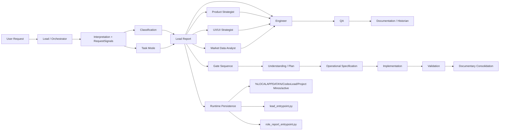
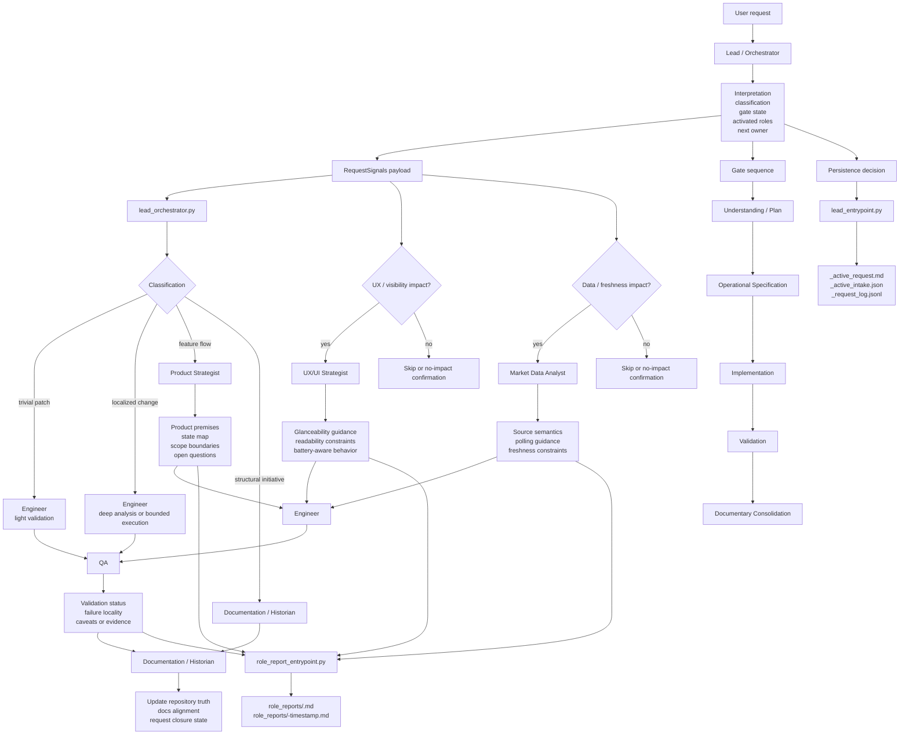

# Agent Flow Visual

- Open `agent_flow_visual.html` in a browser to inspect the current multiagent flow as a node-based visual map.
- The visual is derived from `AGENTS.md`, `docs/playbooks/activation_matrix.md`, `docs/agents/`, and the orchestration scripts under `tools/multiagent/`.
- Treat the HTML file as a documentation lens over the current routing logic, not as the source of truth itself.

## Mermaid View

## Detailed Routing View

## Agent Detail Matrix

| Agent | Recebe | Faz | Gera | Envia para |
|---|---|---|---|---|
| `Lead / Orchestrator` | pedido do usuário, contexto atual, sinais de impacto | interpreta o pedido, classifica, define `task mode`, abre gate, ativa papéis por profundidade, escolhe próximo owner | `Lead Report`, `RequestSignals`, recomendação do próximo passo, riscos e premissas | próximo agente recomendado, runtime persistence via `lead_entrypoint.py` |
| `Product Strategist` | `Lead Report`, dúvidas de comportamento, escopo indefinido | explicita premissas de produto, estados visíveis, retries, recovery, fronteira MVP vs futuro | premissas operacionais, mapa de estados, perguntas abertas | `Engineer`, `Documentation / Historian`, eventualmente volta ao `Lead` |
| `UX/UI Strategist` | impacto visual, mudança de superfície, preocupações de glanceability/acessibilidade | define clareza de fluxo, legibilidade, comportamento battery-aware, implicações de largura e atenção | guidance de UX, restrições de UI, critérios de leitura rápida | `Engineer`, `Documentation / Historian`, eventualmente volta ao `Lead` |
| `Market Data Analyst` | dúvidas de fonte, polling, semântica de cotação, freshness | avalia contratos de dados, cadência, custo/limites, semântica e tradeoffs de histórico | regras de polling, garantias de freshness, decisão de fonte e semântica | `Engineer`, `Documentation / Historian`, eventualmente volta ao `Lead` |
| `Engineer` | premissas aprovadas, constraints técnicos, rota de execução | implementa sem reabrir escopo, registra desvios técnicos, separa falhas do app de bloqueios de ambiente | delta técnico, implementação, notas de restrição | `QA`, `Documentation / Historian`, ou volta ao `Lead` se faltarem premissas |
| `QA` | implementação, critérios aceitos, contexto de falha | valida happy path, edge cases, regressões e localidade do problema | status `not tested`, `failed` ou `passed with caveats`, evidências e caveats | `Documentation / Historian`, `Lead / Orchestrator` |
| `Documentation / Historian` | outputs dos demais agentes, evidências, docs atuais | consolida a verdade do repositório, alinha docs, preserva riscos e trabalho pendente | atualização de `docs/*`, fechamento documental, memória do request | repositório como fonte de verdade, fechamento da request |

## Persistence Paths

- `lead_entrypoint.py` persiste o intake em `%LOCALAPPDATA%\CodexLead\Project Minos\active`.
- Os arquivos principais do ciclo ativo são `_active_request.md`, `_active_intake.json` e `_request_log.jsonl`.
- `role_report_entrypoint.py` persiste relatórios em `role_reports/`.
- Cada relatório de papel gera duas visões:
  - um arquivo estável `role_reports/<role>.md`
  - um arquivo histórico `role_reports/<role>-<timestamp>.md`

## Reading Notes

- Toda request entra por `Lead / Orchestrator`.
- O `Lead` classifica o pedido, define `task mode`, abre os gates e recomenda o próximo papel.
- `Product`, `UX/UI` e `Market Data` entram quando há impacto em comportamento, experiência ou semântica dos dados.
- `Engineer` implementa apenas depois das premissas estarem claras.
- `QA` e `Documentation / Historian` fecham validação e consolidação documental.
